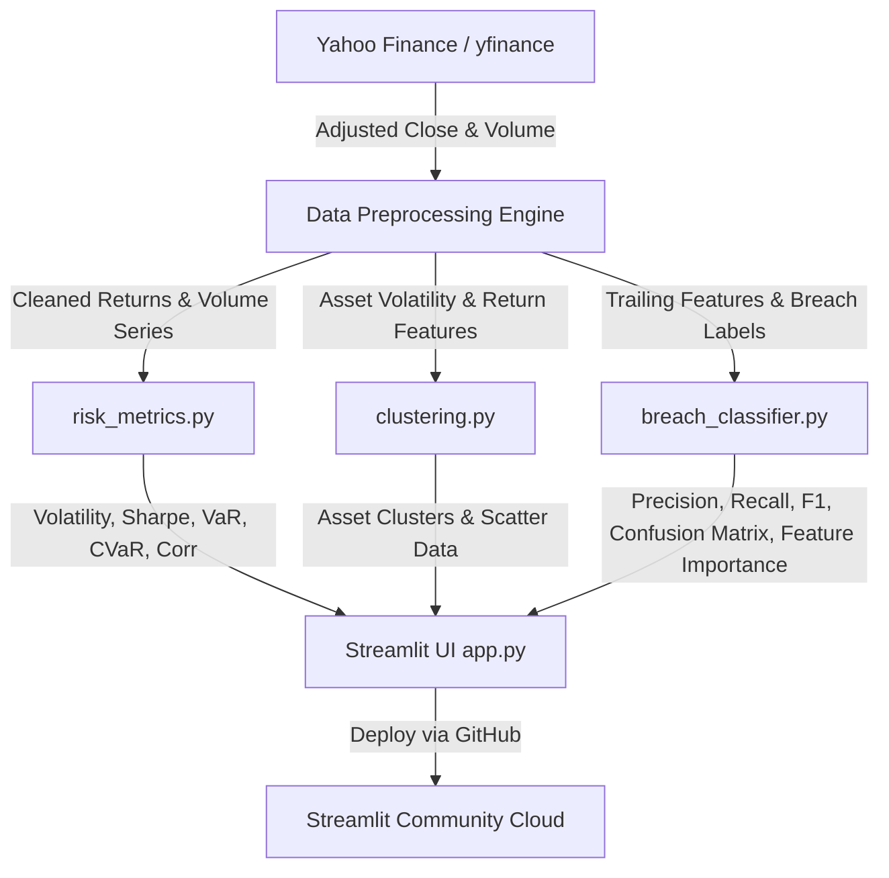

# 📊 Portfolio Risk Analyzer

A clean, production-ready Python web application built with **Streamlit** that allows investors to analyze stock portfolios, calculate key risk metrics, evaluate downside risk via Historical Value at Risk (VaR) and Expected Shortfall (CVaR), discover asset risk/return regimes using unsupervised K-Means clustering, and predict high-risk breach events using supervised machine learning.

---

## 🏛️ System Architecture



---

## 🚀 Live Demo & Quickstart

### Prerequisites
- Python 3.11+
- Git

### 1. Local Setup
Clone the repository and install dependencies:

```bash
# Clone repository
git clone https://github.com/SubXer00/Portfolio-Risk-Analyzer.git
cd Portfolio-Risk-Analyzer

# (Optional) Create and activate a virtual environment
python -m venv venv
# On Windows:
venv\Scripts\activate
# On macOS/Linux:
source venv/bin/activate

# Install required packages
pip install -r requirements.txt
```

### 2. Running the App Locally
Run the Streamlit application:

```bash
streamlit run app.py
```

Open your browser and navigate to `http://localhost:8501`.

---

## ☁️ Deployment to Streamlit Community Cloud

This project is configured for one-click deployment on [Streamlit Community Cloud](https://streamlit.io/cloud):

1. Push this repository to GitHub (ensure `app.py`, `risk_metrics.py`, `clustering.py`, `breach_classifier.py`, and `requirements.txt` are at the repository root).
2. Log in to [Streamlit Community Cloud](https://share.streamlit.io/).
3. Click **"Create app"** ➔ **"I already have an app"**.
4. Select your GitHub repository (`SubXer00/Portfolio-Risk-Analyzer`), branch (`main`), and main file path (`app.py`).
5. Click **"Deploy!"**. Streamlit will automatically install dependencies from `requirements.txt` and launch the app.

---

## 🏗️ Architecture & Codebase Structure

The project strictly decouples financial mathematics and machine learning from UI rendering to ensure clean unit-testability and maintainability:

```text
├── .streamlit/
│   └── config.toml         # Custom financial dark theme configuration
├── app.py                  # Streamlit tabbed UI, dashboard layout, and visual components
├── risk_metrics.py         # Pure financial mathematics (Volatility, Sharpe, VaR, CVaR, Corr)
├── clustering.py           # Unsupervised K-Means clustering module (scikit-learn)
├── breach_classifier.py    # Supervised VaR breach classification & feature importance module
├── test_analyzer.py        # Automated unit test suite (15 unit tests)
├── requirements.txt        # Pinned dependencies for local and cloud environments
└── README.md               # System architecture, formulas, and user guide
```

---

## 📐 Mathematical Foundations & Financial Methodology

### 1. Daily Asset Returns & Portfolio Return Series
For each asset $i$ at day $t$, daily percentage return is calculated from adjusted close prices $P$:
$$R_{i, t} = \frac{P_{i, t} - P_{i, t-1}}{P_{i, t-1}}$$

For a portfolio with asset weights $\mathbf{w} = [w_1, w_2, \dots, w_N]^T$ where $\sum_{i=1}^N w_i = 1$:
$$R_{p, t} = \sum_{i=1}^{N} w_i \cdot R_{i, t}$$

---

### 2. Annualized Volatility ($\sigma_{\text{ann}}$)
Volatility measures the dispersion of returns scaled using the standard 252 US trading days convention (**Square Root of Time Rule**):
$$\sigma_{\text{ann}} = \sigma_{\text{daily}} \times \sqrt{252}$$

---

### 3. Annualized Sharpe Ratio
Quantifies excess return generated per unit of total risk above the benchmark risk-free rate $R_f$ (default: 4.0%):
$$\mu_{\text{ann}} = \mu_{\text{daily}} \times 252$$
$$\text{Sharpe Ratio} = \frac{\mu_{\text{ann}} - R_f}{\sigma_{\text{ann}}}$$

---

### 4. 1-Day 95% Historical Value at Risk (VaR)
Non-parametric quantile calculation on empirical daily portfolio returns:
$$\text{VaR}_{\text{cutoff}} = \text{Percentile}_{5\%}(R_p)$$
$$\text{VaR}_{\%} = |\text{VaR}_{\text{cutoff}}| \quad (\text{if } \text{VaR}_{\text{cutoff}} < 0)$$
$$\text{VaR}_{\$} = \text{VaR}_{\%} \times \text{Portfolio Value}$$

- **Meaning**: On 95% of trading days (19 out of 20 days), your 1-day portfolio loss is not expected to exceed $\text{VaR}_{\%}$.

---

### 5. 1-Day 95% Expected Shortfall / Conditional VaR (CVaR)
While VaR marks the boundary of the worst 5% tail, **Expected Shortfall (CVaR)** answers: *"If a breach happens, how bad is the average loss?"*
$$\text{CVaR} = \mathbb{E}[R_p \mid R_p \le \text{VaR}_{\text{cutoff}}]$$
$$\text{CVaR}_{\%} = |\text{CVaR}|$$
$$\text{CVaR}_{\$} = \text{CVaR}_{\%} \times \text{Portfolio Value}$$

- **Mathematical Invariant**: $\text{CVaR}_{\%} \ge \text{VaR}_{\%}$ (the conditional tail mean is always at least as severe as the boundary quantile).

---

### 6. Unsupervised K-Means Clustering
- **Features**: 2D feature vector for each stock: $(\text{Annualized Volatility}, \text{Annualized Return})$.
- **Algorithm**: `KMeans(n_clusters=k, random_state=42)` grouping assets into risk/return regimes without subjective labels.

---

### 7. Supervised VaR Breach Classifier & Feature Importance

#### Goal
Predict whether day $t$ will experience a **high-risk breach** ($R_{p,t} \le \text{VaR}_{95\%}$).

#### Predictive Features (Strictly Backward-Looking, Zero Look-Ahead Bias)
1. **Rolling 20-Day Realized Volatility**: Trailing annualized standard deviation over days $[t-20, t-1]$.
2. **5-Day Momentum**: Trailing compounded return over days $[t-5, t-1]$.
3. **20-Day Volume Trend**: Percentage deviation of trailing portfolio volume vs. its 20-day moving average over days $[t-20, t-1]$.

#### Time-Series Split
Chronological train/test split (first 80% for training, last 20% for testing). **No random shuffle** to prevent temporal data leakage.

#### Models & Evaluation
- **Models**: `RandomForestClassifier` (default) and `LogisticRegression` (with balanced class weights).
- **Metrics**: Precision, Recall (Sensitivity), F1-score, and Confusion Matrix.
- **Feature Importance**: MDI feature importances (Random Forest) or regression coefficients (Logistic Regression) explaining the relative predictive influence of each signal.

---

## 🧪 Running Automated Unit Tests

A comprehensive unit test suite is included in `test_analyzer.py`:

```bash
python -m unittest test_analyzer.py -v
```

This verifies:
- Daily returns, portfolio dot-product weighting, annualized volatility, return, and Sharpe ratio.
- 5th percentile empirical VaR and Expected Shortfall (CVaR invariant $\text{CVaR} \ge \text{VaR}$).
- Pearson correlation matrix properties.
- Compounded cumulative return series.
- Scikit-learn K-Means feature extraction and cluster assignment.
- Supervised feature construction (strictly no lookahead bias).
- Chronological time-series splitting (zero leakage).
- Random Forest and Logistic Regression training, evaluation metrics, and feature importance extraction.

---

## 🛠️ Tech Stack
- **UI Framework**: [Streamlit](https://streamlit.io/) (Tabs, dark theme, responsive metrics)
- **Financial Data**: [yfinance](https://github.com/ranaroussi/yfinance)
- **Data Analysis**: [pandas](https://pandas.pydata.org/), [numpy](https://numpy.org/)
- **Machine Learning**: [scikit-learn](https://scikit-learn.org/) (KMeans, RandomForestClassifier, LogisticRegression)
- **Visualizations**: [matplotlib](https://matplotlib.org/), [seaborn](https://seaborn.pydata.org/)
